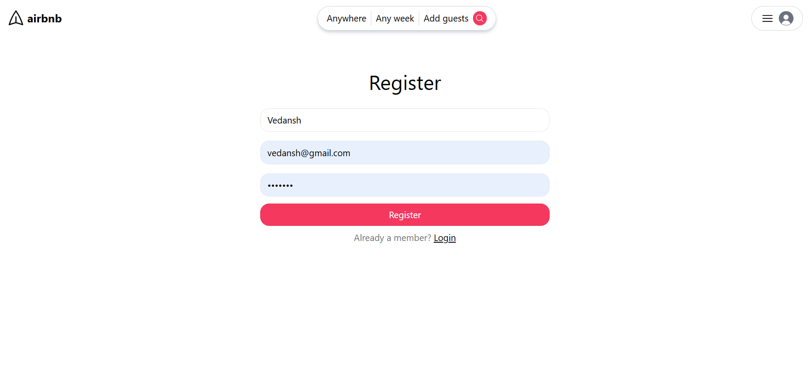
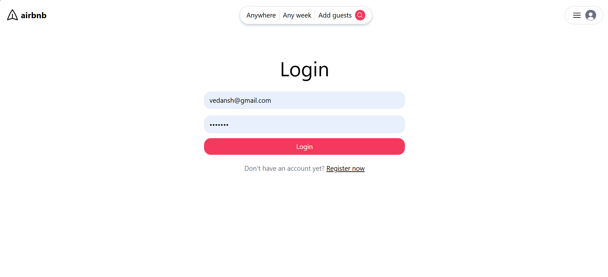
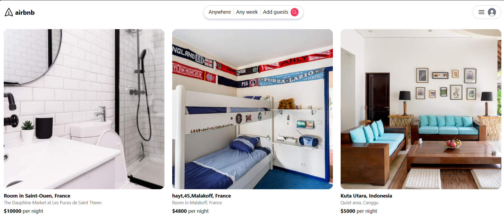
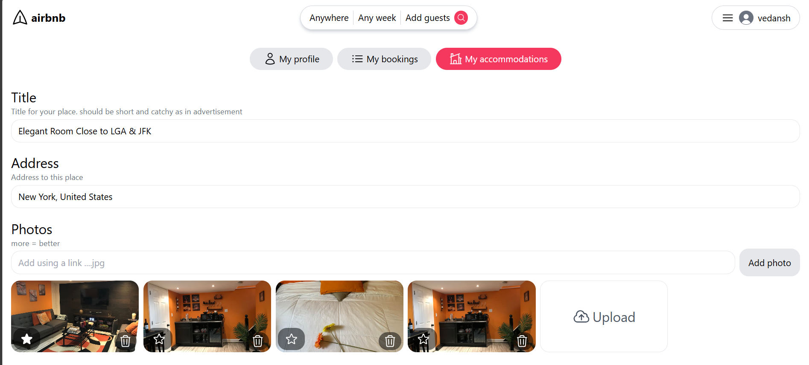
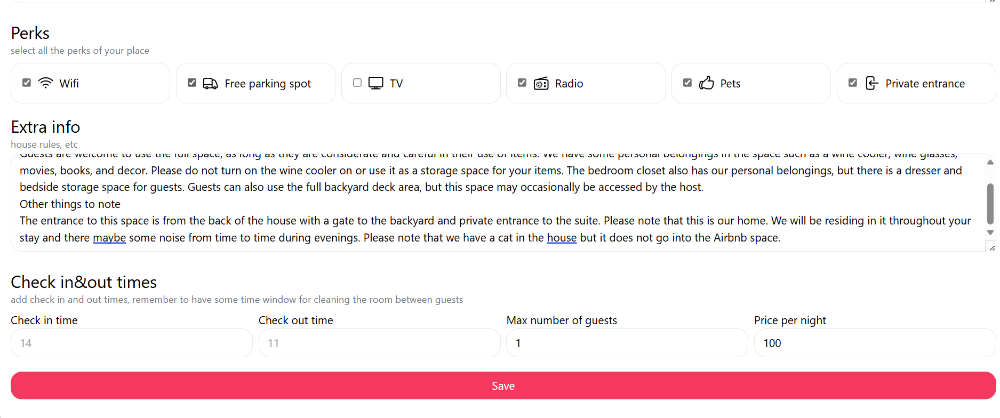
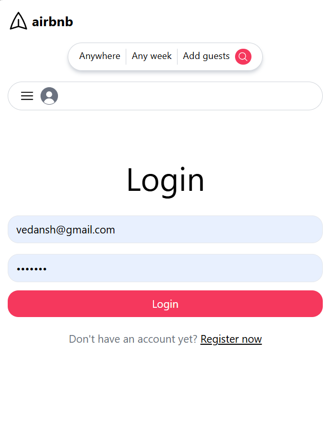

## 🔗 Quick Links

1. [Overview](#-overview)
2. [Demo](#-demo)
3. [Features](#️-features)
4. [Getting Started](#-getting-started)
<!-- 5. [Configuration](#-configuration)
6. [Examples](#-examples)
7. [Contributing](#-contributing) -->

---
<!-- 
## 🔮 Overview

README-AI is a developer tool that automatically generates README markdown files using a robust repository processing engine and advanced language models. Simply provide a URL or path to your codebase, and a well-structured and detailed README will be generated. -->

## 👾 Demo

**Screen Shots**

  
  
  
  
  

  
  

## ☄️ Features

- **🔒 Secure Authentication:** Users can sign up and log in using secure authentication mechanisms with JWT tokens for session management.
- **🏨 Easy Hotel Booking:** Users can browse and effortlessly book hotels, ensuring a seamless user experienc.
- **📋 Hotel Listing:** Users can browse and effortlessly book hotels, ensuring a seamless user experience.
- **💎 User-Friendly Interface** Create boilerplate README files offline, without any external API calls.
- **🎯 Responsive Design:** Optimized for devices of all sizes, ensuring usability across desktops, tablets, and mobile device.
